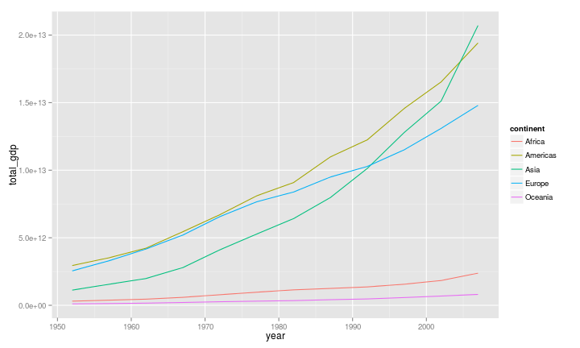

magrittr + dplyr + tidyr
========================================================
author: Vitor Aguiar

magrittr
========================================================
type: section

magrittr
=======================================================
title: false
type: sub-section

<big style="font-size:7em"> *%>%* </big>

[Ceci n'est pas une pipe](http://uploads7.wikiart.org/images/rene-magritte/the-treachery-of-images-this-is-not-a-pipe-1948%282%29.jpg)

magrittr operators
=======================================================

*%>%*  

*%T>%*  

*%$%*  

*%<>%*

pipe usage
======================================================


```r
f(x)

# is the same as:

x %>% f()

## with two arguments:
f(x, y)

# is the same as:
x %>% f(y)

## if you don't want the input to be used as 1st argument:
f(y, x)

# is the same as:
x %>% f(y, .)
```

dplyr
=======================================================
type: sub-section

(aka plyr for data frames)


dplyr verbs
=======================================================

filter

slice

group_by

arrange

select

summarise

mutate

demo
======================================================
title: false

We'll use the [gapminder](https://www.youtube.com/watch?v=jbkSRLYSojo) data for a demo


```r
library(gapminder)

str(gapminder)
```

```
'data.frame':	1704 obs. of  6 variables:
 $ country  : Factor w/ 142 levels "Afghanistan",..: 1 1 1 1 1 1 1 1 1 1 ...
 $ continent: Factor w/ 5 levels "Africa","Americas",..: 3 3 3 3 3 3 3 3 3 3 ...
 $ year     : num  1952 1957 1962 1967 1972 ...
 $ lifeExp  : num  28.8 30.3 32 34 36.1 ...
 $ pop      : num  8425333 9240934 10267083 11537966 13079460 ...
 $ gdpPercap: num  779 821 853 836 740 ...
```

dplyr demo
======================================================
title: false


```r
library(dplyr)
```


```r
gapminder <- tbl_df(gapminder)

gapminder
```

```
Source: local data frame [1,704 x 6]

       country continent year lifeExp      pop gdpPercap
1  Afghanistan      Asia 1952  28.801  8425333  779.4453
2  Afghanistan      Asia 1957  30.332  9240934  820.8530
3  Afghanistan      Asia 1962  31.997 10267083  853.1007
4  Afghanistan      Asia 1967  34.020 11537966  836.1971
5  Afghanistan      Asia 1972  36.088 13079460  739.9811
6  Afghanistan      Asia 1977  38.438 14880372  786.1134
7  Afghanistan      Asia 1982  39.854 12881816  978.0114
8  Afghanistan      Asia 1987  40.822 13867957  852.3959
9  Afghanistan      Asia 1992  41.674 16317921  649.3414
10 Afghanistan      Asia 1997  41.763 22227415  635.3414
..         ...       ...  ...     ...      ...       ...
```

count
======================================================


```r
gapminder %>% count(country)
```

```
Source: local data frame [142 x 2]

       country  n
1  Afghanistan 12
2      Albania 12
3      Algeria 12
4       Angola 12
5    Argentina 12
6    Australia 12
7      Austria 12
8      Bahrain 12
9   Bangladesh 12
10     Belgium 12
..         ... ..
```

filter and select
======================================================


```r
gapminder %>%
  filter(country == "Brazil", year >= 1980) %>%
  select(year, pop, lifeExp, gdpPercap)
```

```
Source: local data frame [6 x 4]

  year       pop lifeExp gdpPercap
1 1982 128962939  63.336  7030.836
2 1987 142938076  65.205  7807.096
3 1992 155975974  67.057  6950.283
4 1997 168546719  69.388  7957.981
5 2002 179914212  71.006  8131.213
6 2007 190010647  72.390  9065.801
```

arrange
======================================================


```r
gapminder %>%
  arrange(lifeExp) %>%
  slice(1:10)
```

```
Source: local data frame [10 x 6]

        country continent year lifeExp     pop gdpPercap
1        Rwanda    Africa 1992  23.599 7290203  737.0686
2   Afghanistan      Asia 1952  28.801 8425333  779.4453
3        Gambia    Africa 1952  30.000  284320  485.2307
4        Angola    Africa 1952  30.015 4232095 3520.6103
5  Sierra Leone    Africa 1952  30.331 2143249  879.7877
6   Afghanistan      Asia 1957  30.332 9240934  820.8530
7      Cambodia      Asia 1977  31.220 6978607  524.9722
8    Mozambique    Africa 1952  31.286 6446316  468.5260
9  Sierra Leone    Africa 1957  31.570 2295678 1004.4844
10 Burkina Faso    Africa 1952  31.975 4469979  543.2552
```

arrange by multiple variables
======================================================


```r
gapminder %>%
  arrange(desc(pop), gdpPercap, lifeExp)
```

```
Source: local data frame [1,704 x 6]

   country continent year  lifeExp        pop gdpPercap
1    China      Asia 2007 72.96100 1318683096 4959.1149
2    China      Asia 2002 72.02800 1280400000 3119.2809
3    China      Asia 1997 70.42600 1230075000 2289.2341
4    China      Asia 1992 68.69000 1164970000 1655.7842
5    India      Asia 2007 64.69800 1110396331 2452.2104
6    China      Asia 1987 67.27400 1084035000 1378.9040
7    India      Asia 2002 62.87900 1034172547 1746.7695
8    China      Asia 1982 65.52500 1000281000  962.4214
9    India      Asia 1997 61.76500  959000000 1458.8174
10   China      Asia 1977 63.96736  943455000  741.2375
..     ...       ...  ...      ...        ...       ...
```

group_by + summarise
======================================================


```r
gapminder %>%
  group_by(continent) %>%
  summarise(avg_gdp = mean(gdpPercap))
```

```
Source: local data frame [5 x 2]

  continent   avg_gdp
1    Africa  2193.755
2  Americas  7136.110
3      Asia  7902.150
4    Europe 14469.476
5   Oceania 18621.609
```

group_by + summarise: multiple grouping variables
=====================================================


```r
gapminder %>%
  group_by(continent, year) %>%
  summarise(avg_gdp = mean(gdpPercap))
```

```
Source: local data frame [60 x 3]
Groups: continent

   continent year  avg_gdp
1     Africa 1952 1252.572
2     Africa 1957 1385.236
3     Africa 1962 1598.079
4     Africa 1967 2050.364
5     Africa 1972 2339.616
6     Africa 1977 2585.939
7     Africa 1982 2481.593
8     Africa 1987 2282.669
9     Africa 1992 2281.810
10    Africa 1997 2378.760
..       ...  ...      ...
```

summarise: multiple variables
=====================================================


```r
gapminder %>%
  group_by(continent) %>%
  summarise_each(funs(mean), lifeExp, gdpPercap, pop)
```

```
Source: local data frame [5 x 4]

  continent  lifeExp gdpPercap      pop
1    Africa 48.86533  2193.755  9916003
2  Americas 64.65874  7136.110 24504795
3      Asia 60.06490  7902.150 77038722
4    Europe 71.90369 14469.476 17169765
5   Oceania 74.32621 18621.609  8874672
```

summarise: mutiple function & multiple variables
======================================================


```r
gapminder %>%
  group_by(continent) %>%
  summarise_each(funs(mean, sd), lifeExp, gdpPercap)
```

```
Source: local data frame [5 x 5]

  continent lifeExp_mean gdpPercap_mean lifeExp_sd gdpPercap_sd
1    Africa     48.86533       2193.755   9.150210     2827.930
2  Americas     64.65874       7136.110   9.345088     6396.764
3      Asia     60.06490       7902.150  11.864532    14045.373
4    Europe     71.90369      14469.476   5.433178     9355.213
5   Oceania     74.32621      18621.609   3.795611     6358.983
```

mutate
=====================================================


```r
gapminder %>% mutate(total_gdp = gdpPercap * pop)
```

```
Source: local data frame [1,704 x 7]

       country continent year lifeExp      pop gdpPercap   total_gdp
1  Afghanistan      Asia 1952  28.801  8425333  779.4453  6567086330
2  Afghanistan      Asia 1957  30.332  9240934  820.8530  7585448670
3  Afghanistan      Asia 1962  31.997 10267083  853.1007  8758855797
4  Afghanistan      Asia 1967  34.020 11537966  836.1971  9648014150
5  Afghanistan      Asia 1972  36.088 13079460  739.9811  9678553274
6  Afghanistan      Asia 1977  38.438 14880372  786.1134 11697659231
7  Afghanistan      Asia 1982  39.854 12881816  978.0114 12598563401
8  Afghanistan      Asia 1987  40.822 13867957  852.3959 11820990309
9  Afghanistan      Asia 1992  41.674 16317921  649.3414 10595901589
10 Afghanistan      Asia 1997  41.763 22227415  635.3414 14121995875
..         ...       ...  ...     ...      ...       ...         ...
```

mutate_each
====================================================


```r
gapminder %>% 
  mutate_each(funs(min_rank), lifeExp, gdpPercap, pop)
```

```
Source: local data frame [1,704 x 6]

       country continent year lifeExp  pop gdpPercap
1  Afghanistan      Asia 1952       2  943       227
2  Afghanistan      Asia 1957       6  999       255
3  Afghanistan      Asia 1962      11 1067       274
4  Afghanistan      Asia 1967      25 1129       262
5  Afghanistan      Asia 1972      45 1169       202
6  Afghanistan      Asia 1977      83 1208       231
7  Afghanistan      Asia 1982     115 1161       344
8  Afghanistan      Asia 1987     153 1181       273
9  Afghanistan      Asia 1992     173 1229       141
10 Afghanistan      Asia 1997     177 1317       134
..         ...       ...  ...     ...  ...       ...
```

data %>% plot
=====================================================


```r
library(ggplot2)

gapminder %>%
  mutate(total_gdp = gdpPercap * pop) %>% 
  group_by(continent, year) %>%
  summarise(total_gdp = sum(total_gdp)) %>%
  ggplot(data = ., aes(x = year, y = total_gdp, color = continent)) + 
    geom_line()
```




tidyr
=======================================================
type: sub-section


Plant height data measured in 3 different months
=======================================================


```
Source: local data frame [20 x 4]

   individual 2015/01/01 2015/02/01 2015/03/01
1       20_SP   12.90560   17.14284   21.26928
2        8_SP   15.29323   15.11989   20.32437
3        9_SP   15.01866   18.16002   20.41623
4        4_SP   14.10559   14.12716   22.13410
5       12_SP   15.48224   15.86814   23.54393
6       18_SP   14.92871   14.63944   23.64979
7        6_SP   14.78449   17.04781   19.24158
8       13_SP   15.84901   16.76724   19.92232
9        5_SP   13.93182   15.47081   20.97048
10       3_SP   14.59161   15.06241   21.84203
11      17_MG   14.53967   15.52908   20.77530
12      10_MG   16.10455   16.82865   21.70555
13      19_MG   14.89850   15.91964   22.00298
14      15_MG   15.10309   18.50573   22.13619
15       1_MG   14.19367   15.44012   23.97472
16      14_MG   14.77630   15.38137   22.08325
17       2_MG   14.41037   16.98292   22.15089
18      11_MG   14.23319   14.56050   20.23721
19      16_MG   14.62096   14.79814   21.10530
20       7_MG   15.24942   16.44457   20.73685
```

tidyr verbs
=======================================================

gather 

spread

separate

unite

extract

gather: 'long' or 'narrow' format
======================================================


```r
library(magrittr)
library(tidyr)

plant_height %<>% gather(key=date, value=height, 2:4)

plant_height
```

```
Source: local data frame [60 x 3]

   individual       date   height
1       20_SP 2015/01/01 12.90560
2        8_SP 2015/01/01 15.29323
3        9_SP 2015/01/01 15.01866
4        4_SP 2015/01/01 14.10559
5       12_SP 2015/01/01 15.48224
6       18_SP 2015/01/01 14.92871
7        6_SP 2015/01/01 14.78449
8       13_SP 2015/01/01 15.84901
9        5_SP 2015/01/01 13.93182
10       3_SP 2015/01/01 14.59161
..        ...        ...      ...
```

spread
======================================================


```r
plant_height %>% spread(date, height)
```

```
Source: local data frame [20 x 4]

   individual 2015/01/01 2015/02/01 2015/03/01
1       10_MG   16.10455   16.82865   21.70555
2       11_MG   14.23319   14.56050   20.23721
3       12_SP   15.48224   15.86814   23.54393
4       13_SP   15.84901   16.76724   19.92232
5       14_MG   14.77630   15.38137   22.08325
6       15_MG   15.10309   18.50573   22.13619
7       16_MG   14.62096   14.79814   21.10530
8       17_MG   14.53967   15.52908   20.77530
9       18_SP   14.92871   14.63944   23.64979
10      19_MG   14.89850   15.91964   22.00298
11       1_MG   14.19367   15.44012   23.97472
12      20_SP   12.90560   17.14284   21.26928
13       2_MG   14.41037   16.98292   22.15089
14       3_SP   14.59161   15.06241   21.84203
15       4_SP   14.10559   14.12716   22.13410
16       5_SP   13.93182   15.47081   20.97048
17       6_SP   14.78449   17.04781   19.24158
18       7_MG   15.24942   16.44457   20.73685
19       8_SP   15.29323   15.11989   20.32437
20       9_SP   15.01866   18.16002   20.41623
```

separate
======================================================


```r
plant_height %<>% 
  separate(individual, into = c("id_number", "state")) %>%
  mutate(id_number = as.numeric(id_number)) %>%
  arrange(id_number, state)

plant_height
```

```
Source: local data frame [60 x 4]

   id_number state       date   height
1          1    MG 2015/01/01 14.19367
2          1    MG 2015/02/01 15.44012
3          1    MG 2015/03/01 23.97472
4          2    MG 2015/01/01 14.41037
5          2    MG 2015/02/01 16.98292
6          2    MG 2015/03/01 22.15089
7          3    SP 2015/01/01 14.59161
8          3    SP 2015/02/01 15.06241
9          3    SP 2015/03/01 21.84203
10         4    SP 2015/01/01 14.10559
..       ...   ...        ...      ...
```

extract
======================================================


```r
plant_height %<>% 
  extract(date, c("year", "month", "day"), "(\\d+)/(\\d+)/(\\d+)")

plant_height
```

```
Source: local data frame [60 x 6]

   id_number state year month day   height
1          1    MG 2015    01  01 14.19367
2          1    MG 2015    02  01 15.44012
3          1    MG 2015    03  01 23.97472
4          2    MG 2015    01  01 14.41037
5          2    MG 2015    02  01 16.98292
6          2    MG 2015    03  01 22.15089
7          3    SP 2015    01  01 14.59161
8          3    SP 2015    02  01 15.06241
9          3    SP 2015    03  01 21.84203
10         4    SP 2015    01  01 14.10559
..       ...   ...  ...   ... ...      ...
```

unite 
======================================================


```r
plant_height %>% unite(date, year:day, sep = "/")
```

```
Source: local data frame [60 x 4]

   id_number state       date   height
1          1    MG 2015/01/01 14.19367
2          1    MG 2015/02/01 15.44012
3          1    MG 2015/03/01 23.97472
4          2    MG 2015/01/01 14.41037
5          2    MG 2015/02/01 16.98292
6          2    MG 2015/03/01 22.15089
7          3    SP 2015/01/01 14.59161
8          3    SP 2015/02/01 15.06241
9          3    SP 2015/03/01 21.84203
10         4    SP 2015/01/01 14.10559
..       ...   ...        ...      ...
```

transpose data frame
======================================================


```r
plant_height %>% spread(id_number, height)
```

```
Source: local data frame [6 x 24]

  state year month day        1        2        3        4        5
1    MG 2015    01  01 14.19367 14.41037       NA       NA       NA
2    MG 2015    02  01 15.44012 16.98292       NA       NA       NA
3    MG 2015    03  01 23.97472 22.15089       NA       NA       NA
4    SP 2015    01  01       NA       NA 14.59161 14.10559 13.93182
5    SP 2015    02  01       NA       NA 15.06241 14.12716 15.47081
6    SP 2015    03  01       NA       NA 21.84203 22.13410 20.97048
Variables not shown: 6 (dbl), 7 (dbl), 8 (dbl), 9 (dbl), 10 (dbl), 11
  (dbl), 12 (dbl), 13 (dbl), 14 (dbl), 15 (dbl), 16 (dbl), 17 (dbl), 18
  (dbl), 19 (dbl), 20 (dbl)
```

Data wrangling cheat sheet
=======================================================
title: false

[Data manipulation cheat sheet](http://www.rstudio.com/wp-content/uploads/2015/02/data-wrangling-cheatsheet.pdf)
